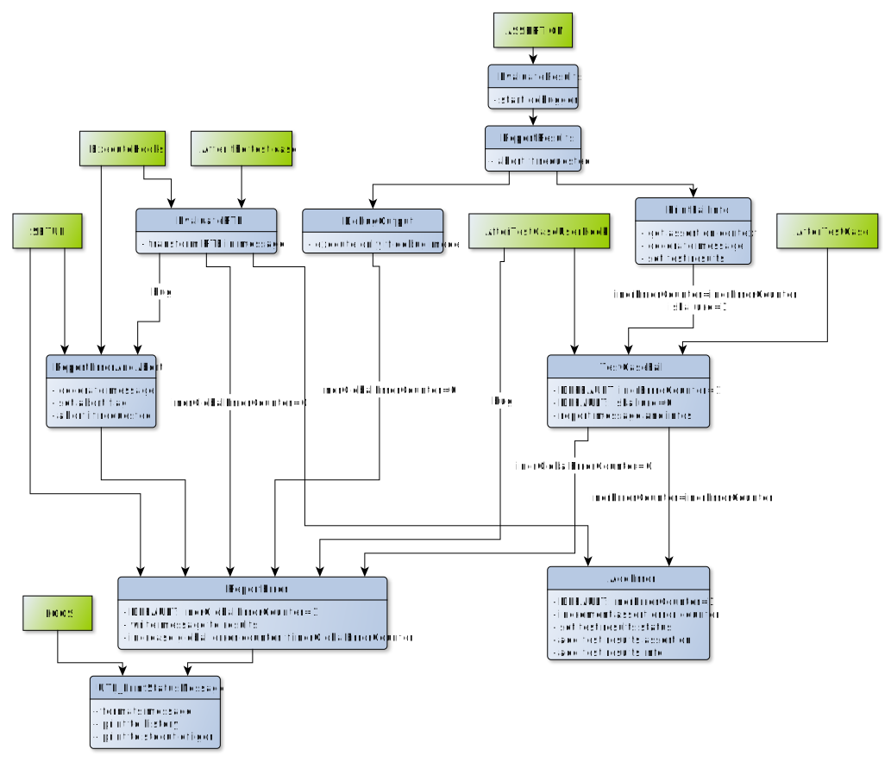

.. vim: set et sts=3 sw=3 tw=79:

.. _developer:

Developer Documentation
=======================

Some diagrams are generated with yEd. Due to license restrictions we have to
include the project file and the generated svg in this repository.

Installation steps for running the tests
----------------------------------------

Create a link from ``tests`` in the ``User Procedures`` subfolder.

.. _Coverage:

Current Test Coverage
---------------------

`Coverage Test Report <report/>`_

.. attention::
   The current coverage test report does only include the results of some tests
   but not all. We intent to migrate existing tests to generate a coverage
   report but it is very unlikely to reach 100% coverage.

.. _GlobalVariables:

Global Variables
----------------

These variables are stored in ``root:Packages:igortest:``.

#. Waves

   * ``DataGeneratorWaves``, ``/WAVE``, 1D
      * used for the multi data test cases
   * ``FailedProcWave``, ``/T``, 1D
      * used for summary at the end of the test run
   * ``FuncLocations``, ``/WAVE``, 2D
      * used for tracing analytics to find original function location and names
   * ``FunctionTagWaves``, ``/WAVE``, 1D
      * contains function tags
   * ``ProcSizes``, 1D
      * Used for tracing analytics to know the original size of the procedure files
   * ``TestRunData``, ``/T``, 2D
      * Contains the setup data for each test case
   * ``TestRunResult``, ``/T``, 2D
      * Contains the test results for the test run
   * ``TestSuiteResult``, ``/T``, 2D
      * Contains the test results for the test suites
   * ``TestCaseResult``, ``/T``, 2D
      * Contains the test results for the test cases
   * ``TestAssertionResult``, ``/T``, 2D
      * Contains the assertions for the test cases
   * ``TestInfoResult``, ``/T``, 2D
      * Contains the infos for the assertions
   * ``InfoMsg``, ``/T``, 1D
      * Contains the stored information that provide more context for the next
        assertion.

#. Variables

   * ``abortFlag``
      * if set the test run will be cancelled
   * ``BCKG_Register``
      * used to check for registered background monitor
   * ``expected_failure_flag``
      * set if the next test case is expected to fail
   * ``igor_debug_assertion``
      * used for debugger
   * ``igor_debug_state``
      * used for debugger
   * ``waveTrackingMode``
      * used to specify the current wave tracking behavior

#. Strings

   * ``baseFilename``
      * used to specify the output filename
   * ``baseFilenameOverwrite``
      * used to overwrite the default ``baseFilename``
   * ``lastFolder``
      * The current data folder before the test run. This is used to set the
        current data folder back to original one after running the tests.
   * ``workFolder``
      * The current data folder the test run.

.. _BehaviorReporting:

Internal behavior of Reporting Functions
----------------------------------------

