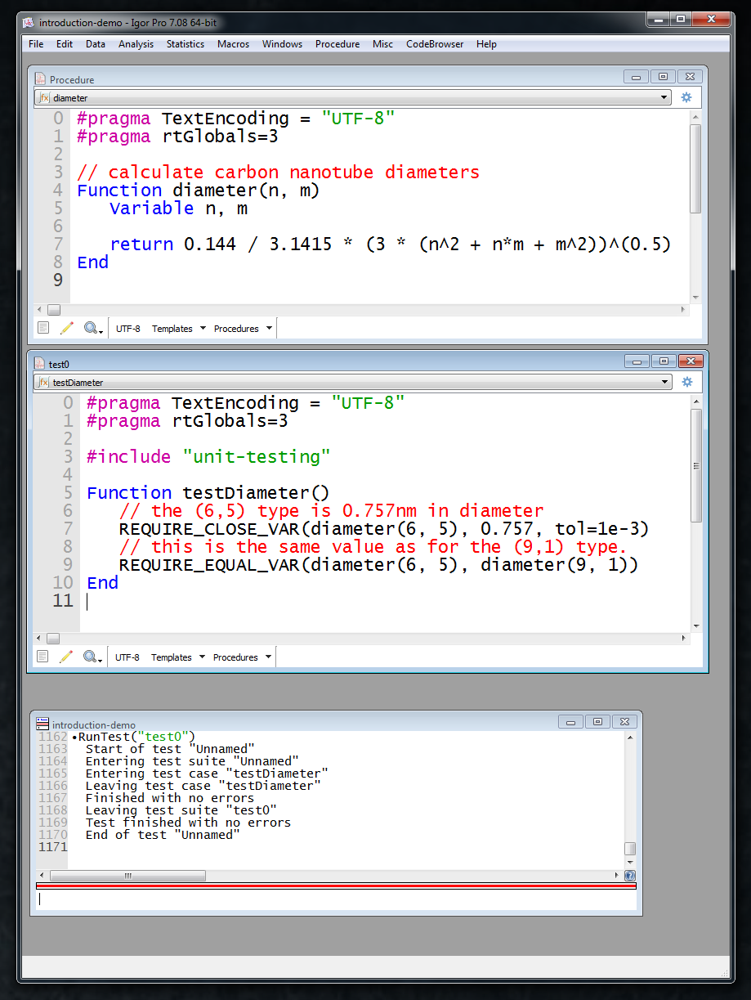

.. vim: set et sts=3 sw=3 tw=79:

.. _tour:

Guided Tour
===========

To visualize the functionality of the Igor Pro Universal Testing Framework, we
will start with a guided tour in which we create our first unit and test it with
the Igor Pro Universal Testing Framework. The tour will cover the following
steps:

* :ref:`tour_create`
* :ref:`tour_test`
* :ref:`tour_execute`
* :ref:`tour_extend`

Please make sure that the framework has been properly installed if you wish to
follow the guide. For the framework to work, the files from the `procedures folder
<https://github.com/byte-physics/igor-unit-testing-framework/tree/master/procedures>`__
should be placed into the `User Procedures` Folder of your Igor Pro setup.

.. _tour_create:

Creating a unit
---------------

We will start by creating a simple unit.

The following formula gives the diameter :math:`d` of a carbon nanotube:

.. math::

	d = \frac{a_0}{\pi}\cdot\sqrt{n^2+m^2+nm}

The natural numbers :math:`n` and :math:`m` define the carbon nanotube type.
:math:`a_0` is the unit cell lattice constant of graphene (Understanding the
background of the above formula is not required here).

The formula is easily translated into Igor Pro code:

.. code-block:: igorpro
   :linenos:
   :caption: Procedure

   #pragma TextEncoding = "UTF-8"
   #pragma rtGlobals=3

   // calculate carbon nanotube diameters
   Function diameter(n, m)
       Variable n, m

       return 0.144 / 3.1415 * (3 * (n^2 + n*m + m^2))^(0.5)
   End

.. _tour_test:

Testing the unit
----------------

If we want to rely on this formula with other calculations, we have to test if
the output of this function is both correct and within our required accuracy
range. To perform these two tests, we define a :ref:`TestCase`.

.. code-block:: igorpro
   :linenos:
   :caption: test0

   #pragma TextEncoding = "UTF-8"
   #pragma rtGlobals=3

   #include "igortest"

   Function testDiameter()
       // the (6,5) type is 0.757nm in diameter
       REQUIRE_CLOSE_VAR(diameter(6, 5), 0.757, tol=1e-3)
       // this is the same value as for the (9,1) type.
       REQUIRE_EQUAL_VAR(diameter(6, 5), diameter(9, 1))
   End

The test case :code:`testDiameter` contains two checks. Both are required to
pass the test suite. In the context of this framework we will refer to them as
:ref:`assertions <AssertionTypes>`. The first assertion
:code:`REQUIRE_CLOSE_VAR` compares the two floating point numbers within the
given tolerance of 0.001nm. The second :code:`REQUIRE_EQUAL_VAR` uses a
mathematical peculiarity of the above formula to check if the calculation gives
correct output.

The test case function can be placed anywhere inside the main procedure file,
but it can be considered good practice to separate test cases into a procedure
file of their own. Such a separate procedure file that only contains test cases
is called a :ref:`TestSuite`. A test suite can for example perform all the necessary
tests for a unit.

.. _tour_execute:

Executing the test
------------------

To execute the test suite we use the :cpp:func:`RunTest` directive. It accepts
the name of our test suite (the procedure window) as an argument. In our
example we have named the procedure window :code:`"test0"`.

.. code-block:: console
   :emphasize-lines: 8

   •RunTest("test0")
     Start of test "Unnamed"
     Entering test suite "Unnamed"
     Entering test case "testDiameter"
     Leaving test case "testDiameter"
     Finished with no errors
     Leaving test suite "test0"
     Test finished with no errors
     End of test "Unnamed"

In the cosole output above, the highlighted line indicates that all tests
within the current test suite have passed successfully. The unit is working
properly. The full Igor Pro environment with our unit test should look like
this:

.. _tour_extend:

Extending the test
------------------

Note, that we have defined a test case for the current capabilities of our
function :code:`diameter()`. The calculation is only exact up to the specified
error range. The high error is caused by a fixated value of
:code:`pi=3.1415`. To emphasize this, we can add an assertion to the test case
that will fail but will not affect the error counter. Such an assertion is done
with a `WARN_*` directive. Every `REQUIRE_*` assertion also has a
`WARN_*` variant, see:ref:`AssertionTypes` for a summary.

.. code-block:: igorpro
   :emphasize-lines: 6,7

   Function testDiameter()
       // the (6,5) type is 0.757nm in diameter
       REQUIRE_CLOSE_VAR(diameter(6, 5), 0.757, tol=1e-3)
       // this is the same value as for the (9,1) type.
       REQUIRE_EQUAL_VAR(diameter(6, 5), diameter(9, 1))
       // warn if accuracy is not exact
       WARN_CLOSE_VAR(diameter(6, 5), 0.7573453, tol=1e-7)
   End

The output of :cpp:func:`RunTest` will now include a warning assertion without
failing the test case:

.. code-block:: console
   :emphasize-lines: 6,7,9

   •RunTest("test0")
     Start of test "Unnamed"
     Entering test suite "Unnamed"
     Entering test case "testDiameter"
     Entering test case "testDiameter"
     0.757368 ~ 0.757345 with strong check and tol 1e-07: is false
     Assertion "WARN_CLOSE_VAR(diameter(6, 5), 0.7573453, tol=1e-7)" failed in line 11, procedure "test0"
     Leaving test case "testDiameter"
     Finished with no errors
     Leaving test suite "test0"
     Test finished with no errors
     End of test "Unnamed"

If the program should be extended to a higher level of accuracy, this warning
can be set to the corresponding :cpp:func:`REQUIRE<REQUIRE_CLOSE_VAR>`
assertion. The program :code:`diameter` then has to be changed to reflect the
new requirement. In the current example, :math:`pi` would need to be used
instead of only a handful of decimal places hardcoded.

In a test-driven workflow, the unit tests get extended before even changing
anything at the code base. Defining the test case prior to any code production
assures that the software development is not producing unnecessary (and
untested) code.

A more elaborate example for defining a peak find functionality can be found in
the :ref:`examples section <example10>`. For a quick start, also have a look at
the :ref:`first example<example1>`.
